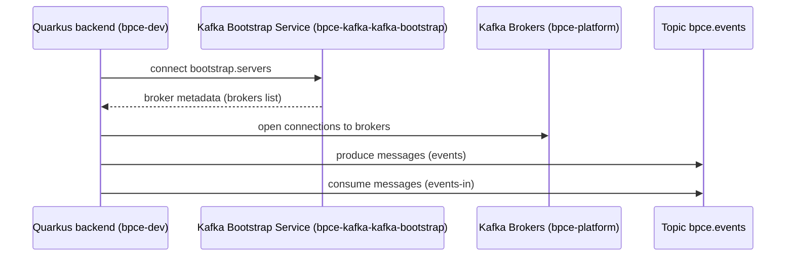

# 03 — Kafka Dataflow

```mermaid
sequenceDiagram
  participant Q as Quarkus backend (bpce-dev)
  participant B as Kafka Bootstrap Service (bpce-kafka-kafka-bootstrap)
  participant K as Kafka Brokers (bpce-platform)
  participant T as Topic bpce.events

  Q->>B: connect bootstrap.servers
  B-->>Q: broker metadata (brokers list)
  Q->>K: open connections to brokers
  Q->>T: produce messages (events)
  Q->>T: consume messages (events-in)
```
