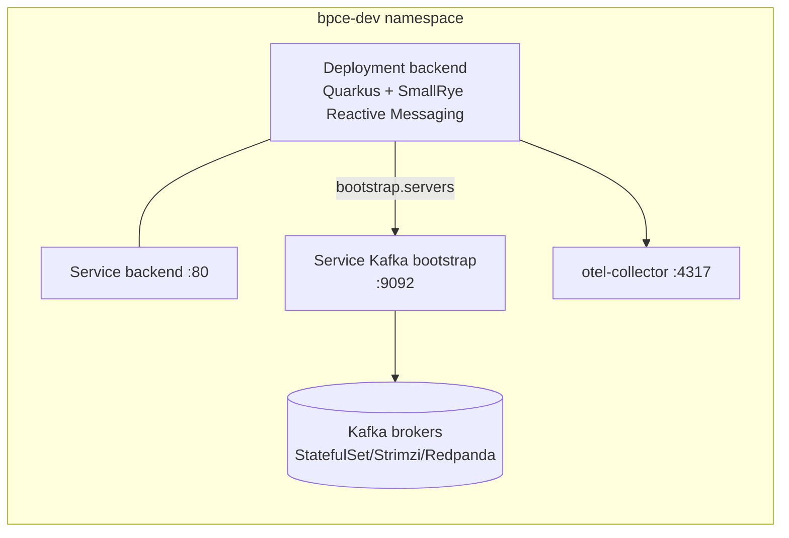
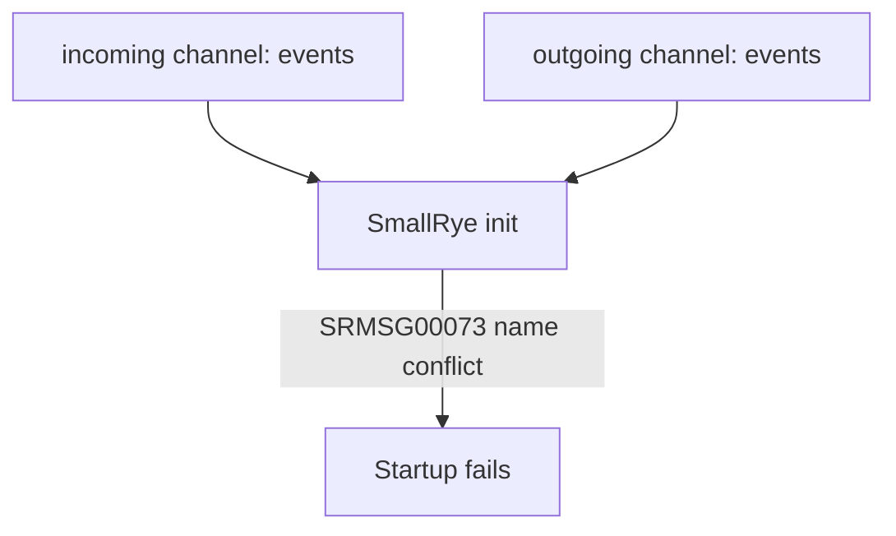
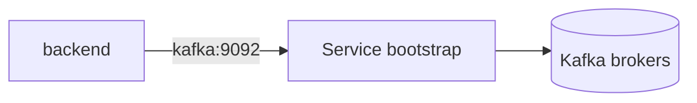

# BPCE Natixis Quarkus Lab — Debug Kafka/Reactive Messaging (CrashLoop → OK)

## 1) Combien de problèmes, exactement ?

### Problème 1 — **Kafka attendu mais absent** (cause racine)
- L’app démarre avec `KAFKA_BOOTSTRAP_SERVERS=kafka:9092`.
- Il **n’existe pas** de `Service kafka` dans `bpce-dev` (ni Kafka/Strimzi/Redpanda dans le cluster).
- Résultat : **DNS failed** (impossible de résoudre `kafka`) → Quarkus échoue au démarrage → **CrashLoopBackOff**.

### Problème 2 — **Tentatives de “désactivation” du messaging** (mauvais flag / mauvais nom de channel)
- Les variables posées ne correspondaient pas au bon channel ou ne neutralisaient pas le mécanisme.
- Résultat : Quarkus/SmallRye remonte des erreurs de config **au démarrage**.

### Problème 3 — **Conflit de channels** (même nom en incoming + outgoing)
- En injectant `MP_MESSAGING_INCOMING_EVENTS_*` et `MP_MESSAGING_OUTGOING_EVENTS_*`, on a créé un cas où `events` était détecté à la fois en incoming et outgoing.
- Résultat : `SRMSG00073` → **startup KO**.

### Problème 4 — **Workaround DNS OK mais Kafka réel absent** (état actuel)
- Création d’un `Service kafka` vide → DNS OK → Quarkus démarre et passe Ready.
- Mais : pas de broker derrière → **warnings** “Connection could not be established” (normal tant qu’il n’y a pas d’Endpoints/brokers).

> Bonus (mineur) : warnings `quarkus.log.console.json.*` “Unrecognized configuration key” = extension de logging JSON manquante ou config non compatible.

---

## 2) Architectures — par problème

### 2.1 Architecture attendue (cible)


### 2.2 Problème 1 — Kafka attendu mais absent (DNS KO)
```mermaid
flowchart LR
  subgraph NS[bpce-dev]
    B[backend pod]
    Env[env: KAFKA_BOOTSTRAP_SERVERS=kafka:9092]
    B --> Env

    Missing[Service kafka\n(n'existe pas)]:::bad
    B -. DNS lookup kafka .-> Missing

    Fail[Quarkus fails startup\nCrashLoopBackOff]:::bad
    B --> Fail
  end

classDef bad fill:#ffdddd,stroke:#cc0000,color:#000;
```

### 2.3 Problème 2 — Tentatives de désactivation (config invalid)
```mermaid
flowchart TD
  EnvPatch[Patch env vars (oc set env)] --> QuarkusCfg[Quarkus config resolution]
  QuarkusCfg --> SR[SmallRye Reactive Messaging init]
  SR -->|Channel config invalid| Crash[Startup fails\nCrashLoopBackOff]

  note1["Ex: SRMSG00071\nconnector attribute must be set"]:::bad
  SR --> note1

classDef bad fill:#ffdddd,stroke:#cc0000,color:#000;
```

### 2.4 Problème 3 — Conflit de nom (incoming + outgoing = events)


### 2.5 Problème 4 — Workaround DNS OK (Service kafka vide)
```mermaid
flowchart LR
  B[backend pod] -->|DNS OK| SvcK[Service kafka :9092\n(no selector)]
  SvcK -.-> NoEP[No Endpoints\nno brokers]:::warn
  B -->|Kafka client connect| NoEP
  B --> Ready[App READY\nhealth endpoints OK]

classDef warn fill:#fff3cd,stroke:#d39e00,color:#000;
```

---

## 3) Ce qu’on a fait — chronologie + commandes (avec commentaires)

### Étape A — Vérifier l’existant (Kafka présent ou non ?)
```bash
# A1) Lister les Services du namespace
oc -n bpce-dev get svc

# A2) Chercher des Services liés à Kafka/Strimzi/Redpanda
oc -n bpce-dev get svc | egrep -i 'kafka|strimzi|broker|redpanda' || true

# B) Voir les variables d’environnement Kafka/Messaging injectées dans le deployment
oc -n bpce-dev set env deploy/backend --list | egrep -i 'KAFKA|MP_MESSAGING|BOOTSTRAP|QUARKUS' || true

# C) Identifier l’origine des env vars (envFrom ConfigMap/Secret vs env direct)
oc -n bpce-dev get deploy backend -o jsonpath='{.spec.template.spec.containers[0].envFrom}{"\n"}'
oc -n bpce-dev get deploy backend -o jsonpath='{.spec.template.spec.containers[0].env}{"\n"}'
```
**Constat :** on avait `KAFKA_BOOTSTRAP_SERVERS=kafka:9092` mais **pas de Service kafka**.

---

### Étape B — Tentative 1 : enlever bootstrap + désactiver un channel (KO)
```bash
# 1) Patch runtime (enlever bootstrap kafka + désactiver un flag)
oc -n bpce-dev set env deploy/backend \
  KAFKA_BOOTSTRAP_SERVERS- \
  MP_MESSAGING_INCOMING_EVENTS_IN_ENABLED=false

# 2) Restart du déploiement
oc -n bpce-dev rollout restart deploy/backend

# 3) Suivre les pods en temps réel
oc -n bpce-dev get pods -l app=backend -w
```
**Résultat :** CrashLoop + erreur de config SmallRye (`SRMSG00071`… connector missing).

---

### Étape C — Debug standard CrashLoop (raison + logs + events)
```bash
# 1) Récupérer le pod backend le plus récent
P=$(oc -n bpce-dev get pods -l app=backend --sort-by=.metadata.creationTimestamp --no-headers | tail -n1 | awk '{print $1}')
echo "P=$P"

# 2) Dernière terminaison (reason/exit code)
oc -n bpce-dev get pod "$P" \
  -o jsonpath='{.status.containerStatuses[0].lastState.terminated.reason}{" exit="}{.status.containerStatuses[0].lastState.terminated.exitCode}{" finishedAt="}{.status.containerStatuses[0].lastState.terminated.finishedAt}{"\n"}'

# 3) Logs du dernier essai (previous) + logs courants
oc -n bpce-dev logs "$P" --previous --tail=200 || true
oc -n bpce-dev logs "$P" --tail=200

# 4) Events (liveness/readiness/OOM/etc.)
oc -n bpce-dev describe pod "$P" | sed -n '/Events:/,$p' | tail -n 160
```

---

### Étape D — Tentative 2 : désactiver `events` incoming + outgoing (KO)
```bash
# Désactiver les channels events (incoming + outgoing)
oc -n bpce-dev set env deploy/backend \
  MP_MESSAGING_INCOMING_EVENTS_ENABLED=false \
  MP_MESSAGING_OUTGOING_EVENTS_ENABLED=false

# Restart
oc -n bpce-dev rollout restart deploy/backend

# Suivre
oc -n bpce-dev get pods -l app=backend -w
```
**Résultat :** toujours KO (l’app exigeait une config valide au démarrage).

---

### Étape E — Tentative 3 : forcer connector + désactiver (KO à cause du conflit)
```bash
# Forcer connector sur events (incoming + outgoing) + keep disabled + nettoyer flags
oc -n bpce-dev set env deploy/backend \
  MP_MESSAGING_INCOMING_EVENTS_CONNECTOR=smallrye-kafka \
  MP_MESSAGING_OUTGOING_EVENTS_CONNECTOR=smallrye-kafka \
  MP_MESSAGING_INCOMING_EVENTS_ENABLED=false \
  MP_MESSAGING_OUTGOING_EVENTS_ENABLED=false \
  MP_MESSAGING_INCOMING_EVENTS_IN_ENABLED- \
  KAFKA_BOOTSTRAP_SERVERS-

# Restart
oc -n bpce-dev rollout restart deploy/backend
```
**Résultat :** `SRMSG00073` (même nom `events` utilisé en incoming + outgoing).

---

### Étape F — Retour arrière vers l’état “simple” (bootstrap kafka uniquement)
```bash
# Remettre bootstrap + enlever les overrides MP_MESSAGING ajoutés
oc -n bpce-dev set env deploy/backend \
  KAFKA_BOOTSTRAP_SERVERS=kafka:9092 \
  MP_MESSAGING_INCOMING_EVENTS_CONNECTOR- \
  MP_MESSAGING_OUTGOING_EVENTS_CONNECTOR- \
  MP_MESSAGING_INCOMING_EVENTS_ENABLED- \
  MP_MESSAGING_OUTGOING_EVENTS_ENABLED- \
  MP_MESSAGING_INCOMING_EVENTS_IN_ENABLED-

oc -n bpce-dev rollout restart deploy/backend

# Vérifier ce qui reste dans l'env
oc -n bpce-dev set env deploy/backend --list | egrep -i 'KAFKA|MP_MESSAGING' || true
```

---

### Étape G — Confirmer que `kafka` n’existe pas (service/endpoints)
```bash
oc -n bpce-dev get svc kafka -o wide || true
oc -n bpce-dev get endpoints kafka -o wide || true
```
**Constat :** `services "kafka" not found`.

---

### Étape H — Vérifier qu’il n’y a pas de Kafka dans tout le cluster
```bash
# Services
oc get svc -A | egrep -i 'kafka|strimzi|redpanda|broker' || true

# Pods
oc get pods -A | egrep -i 'kafka|strimzi|redpanda' || true

# CRDs Strimzi/AMQ Streams
oc get crd | egrep -i 'kafka|strimzi' || true
```
**Constat :** rien.

---

### Étape I — Workaround : créer un Service `kafka` (DNS OK)
```bash
# Créer un Service kafka sans selector (juste pour avoir kafka.bpce-dev.svc)
cat <<'YAML' | oc -n bpce-dev apply -f -
apiVersion: v1
kind: Service
metadata:
  name: kafka
spec:
  ports:
  - name: tcp-kafka
    port: 9092
    targetPort: 9092
YAML

# Vérifier
oc -n bpce-dev get svc kafka -o wide

# Restart backend
oc -n bpce-dev rollout restart deploy/backend

# Suivre
oc -n bpce-dev get pods -l app=backend -w
```
**Résultat :** Quarkus démarre, pod **Ready**.

---

### Étape J — Vérification finale (OK) + comprendre les warnings Kafka
```bash
# Pods
oc -n bpce-dev get pods -l app=backend -o wide

# Pod le plus récent + état
P=$(oc -n bpce-dev get pods -l app=backend --sort-by=.metadata.creationTimestamp --no-headers | tail -n1 | awk '{print $1}')
echo "P=$P"
oc -n bpce-dev get pod "$P" -o jsonpath='{.status.phase}{" ready="}{.status.containerStatuses[0].ready}{" state="}{.status.containerStatuses[0].state}{" restarts="}{.status.containerStatuses[0].restartCount}{"\n"}'

# Logs
oc -n bpce-dev logs "$P" --tail=200

# Endpoints kafka
oc -n bpce-dev get endpoints kafka -o wide
```
**Interprétation :**
- Ready = OK, l’app écoute sur `:8080`.
- Warnings Kafka = normal : **Service existe**, mais **pas de broker** derrière.
- `endpoints kafka not found` = normal : Service sans selector → pas d’Endpoints auto.

---

## 4) Ce qu’il reste à faire (choix d’architecture)

### Option 1 — Mettre un **vrai Kafka** dans le cluster (recommandé)
**But :** remplacer le “Service vide” par un Kafka réel.

Architecture :


Runbook (haut niveau) :
1) Installer un opérateur Kafka (AMQ Streams/Strimzi) via OperatorHub.
2) Créer un cluster Kafka (dev : 1 broker) dans un namespace (ex: `bpce-dev` ou `kafka`).
3) Exposer le bootstrap en Service (souvent généré automatiquement).
4) Mettre `KAFKA_BOOTSTRAP_SERVERS` sur le vrai service (ex: `<cluster>-kafka-bootstrap:9092`).
5) Créer le topic `bpce.events` (si auto-create désactivé).
6) Supprimer le Service `kafka` “fake”.

### Option 2 — Kafka externe (hors cluster)
**But :** pointer vers un vrai Kafka externe sans installer Strimzi.
- Utiliser un `Service` de type `ExternalName` ou un `Service` + `EndpointSlice`/`Endpoints` manuels.

Exemple (ExternalName) :
```yaml
apiVersion: v1
kind: Service
metadata:
  name: kafka
spec:
  type: ExternalName
  externalName: mon-kafka.externe.local
  ports:
  - port: 9092
```

### Option 3 — En dev : démarrer **sans Kafka** (silencieux)
**But :** que l’app démarre même si Kafka n’est pas là.
- Le plus propre : changer la config Quarkus dans le repo (profil `%dev` ou `%prod`), pour rendre Kafka optionnel.
- Exemple d’objectif :
  - désactiver les channels en dev,
  - ou basculer vers un connector in-memory,
  - ou encapsuler les producers/consumers derrière un feature flag.

---

## 5) État actuel (ce que tu vois maintenant)
- ✅ `backend` est **Running/Ready**.
- ⚠️ Kafka est **injoignable** (normal : Service `kafka` existe mais aucun broker derrière).
- ✅ Les probes passent, l’API est accessible.

---

## 6) Prochaine action recommandée (simple, concrète)

Choisir :
1) **On installe un vrai Kafka** (Strimzi/AMQ Streams) et on pointe dessus, **ou**
2) **On rend Kafka optionnel** via config application (profil dev) et on supprime le besoin `kafka:9092`.

Si tu veux la voie la plus “GitOps/OpenShift propre” : **Option 1 (Strimzi/AMQ Streams)**.

