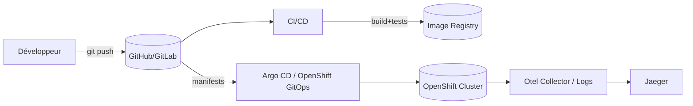

# Architecture (cible)

## Vue logique
- **Backend** Quarkus : API + outillage interne “équipe conteneur”
- **GitOps** : Argo CD = source of truth (manifests + chart/overlays)
- **CI/CD** : pipeline build/test/image + promotion GitOps
- **Observabilité** : OpenTelemetry (traces) + logs structurés
- **Kafka** : flux event-driven (optionnel)

## Diagramme (Mermaid)

## GitOps (principes)
- Repo “déclaratif” = manifests Kustomize + chart Helm
- Environnements via **overlays** et **values**
- Promote = PR + merge (pas de `kubectl edit`)

## Sécurité / gouvernance (à exercer)
- resources requests/limits obligatoires
- probes (startup/readiness/liveness)
- serviceAccount minimal
- NetworkPolicy (optionnel)
